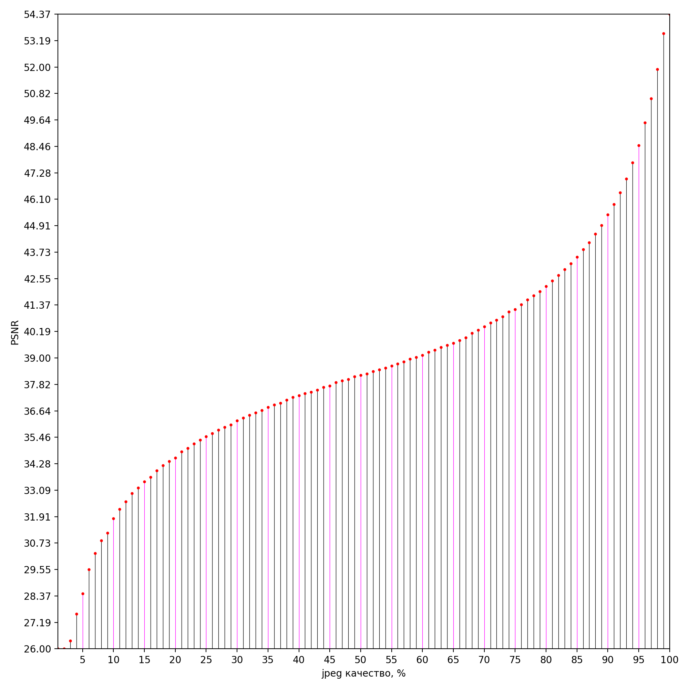
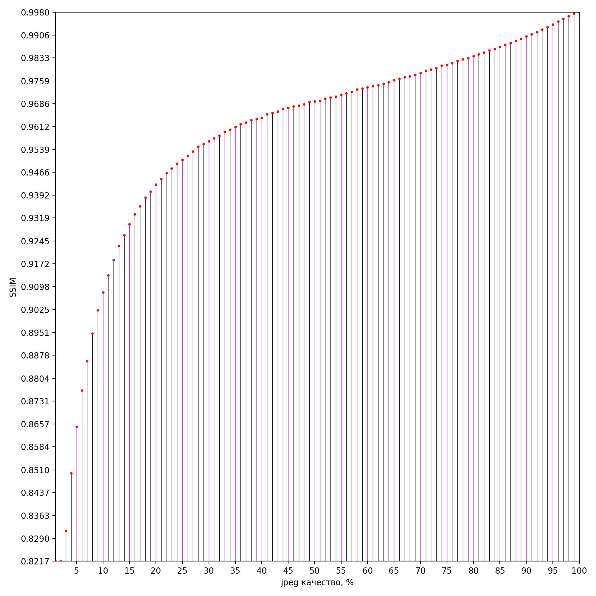
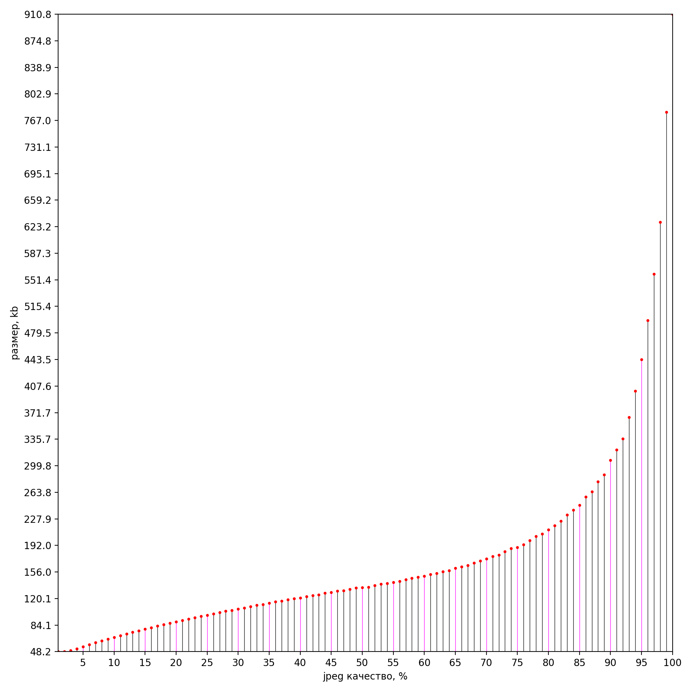
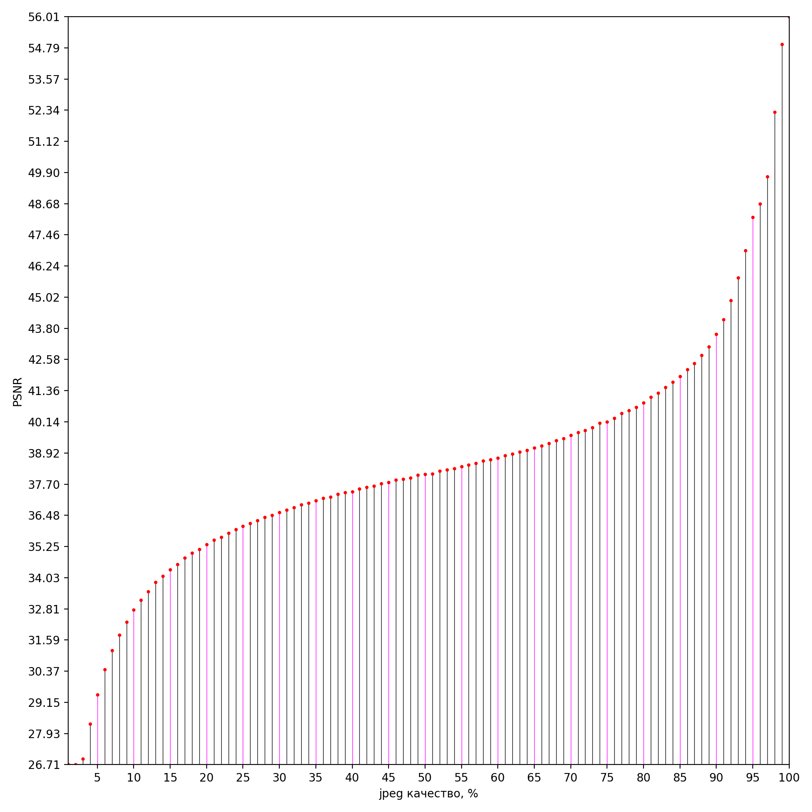
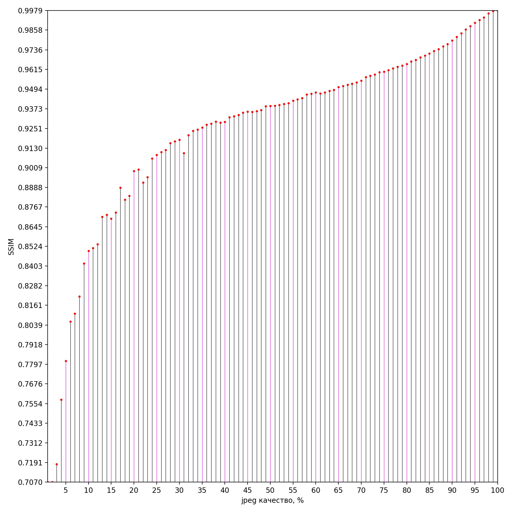
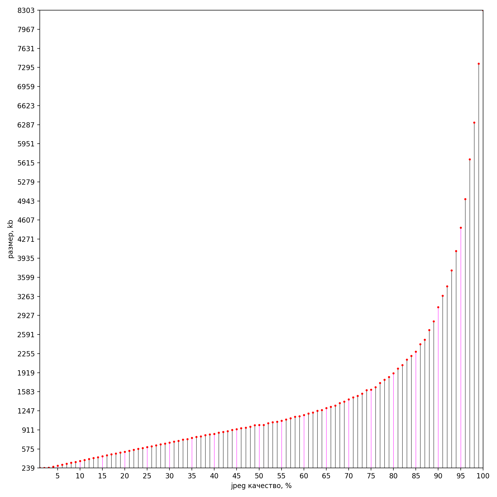
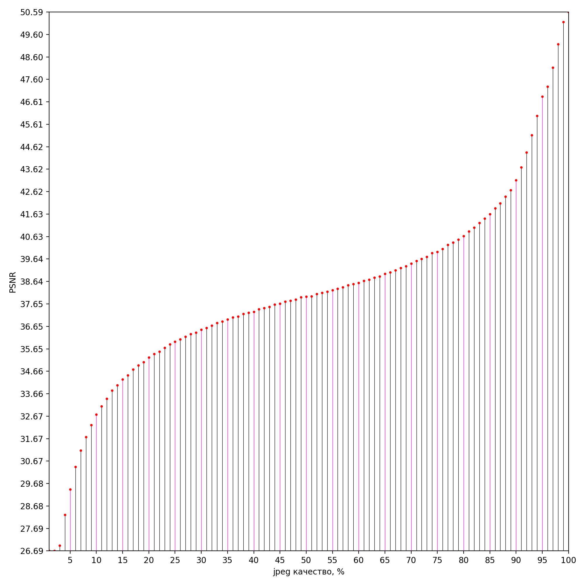
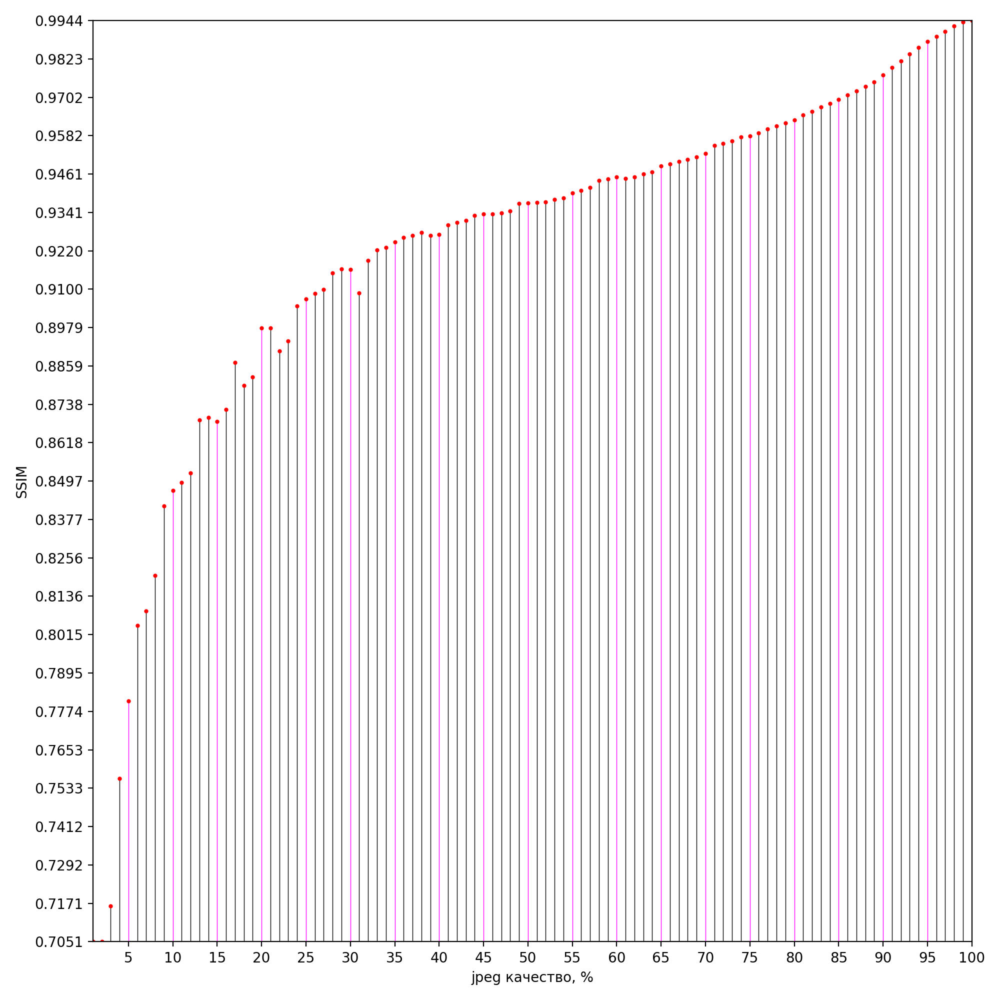

### Скрипт построения графиков размера и SSIM/PSNR в зависимости от % качества jpeg
---
#### Требования
* `python 3.4+ `
	* `matplotlib`
	* `pillow`
	* `psutil` (опционально, нужен для понижения приоритета дочерним процессам при обработке)
* `ffmpeg 3.x` в `PATH`

_[Стабильная версия](https://github.com/MahouShoujoMivutilde/jpeg-quality-graph/releases/latest)_

#### Использование
```
usage: jpeg_graph.py [-h] [-s] [-p] -i I

Строит график зависимости объективного качества (PSNR/SSIM) и размера файла от
% качества jpeg, требует matplotlib, Pillow и опционально psutil, а также
ffmpeg 3.x в PATH

optional arguments:
  -h, --help  show this help message and exit
  -s          Не удалять папку с полученными jpeg
  -p          Подписать соответствующие розовым линиям отметки на OY

required named arguments:
  -i I        Путь к исходному изображению / к папке с исходными изображениями
              (для расчета усредненного графика)
```

#### TODO
* другие форматы сжатия с потерями с варьируемым качеством
* * универсальный график
* * * адекватное количество соответствий никогда не наезжающих друг на друга на oy, а не всегда 24
* * убрать хардкодовый диапазон качества 1% - 100%, где остался
* * поддержка произвольного целого диапазона качества n - m

#### Примеры результатов

##### PNG изображения в аниме-стиле







---

##### JPEG фото с качеством 100%, отрендеренные из raw







---

##### TIFF фото, сжатие без потерь, отрендеренные из raw






---
__ps__ выборка везде 100 изображений.
